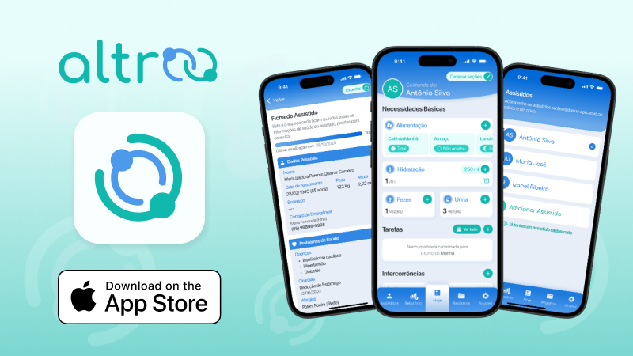
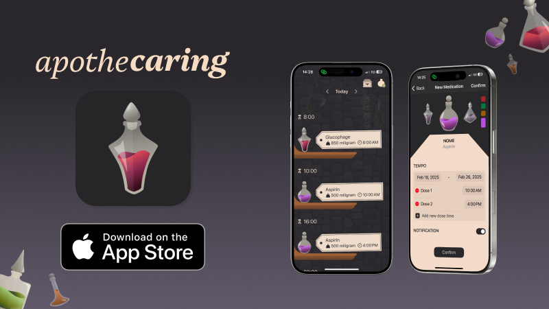

  
  
  
  
  
  
  

### Hi there! I'm Raissa 👋

I'm a passionate **iOS Developer** focused on building scalable apps with Swift and SwiftUI.  

### Focus areas:
- 🔭 Working as an iOS developer at Apple Developer Academy  
- 📚 Currently learning Combine  
- ⚡ In my free time I dance and cook

Feel free to check out my projects and connect with me!

  
  
  

 

<table>
  <tr>
    <td align="top" width="280">
      
      <h3>Altroo</h3>
      

        An app for professional caretakers to monitor the patients health.
      

      
<strong>Role:</strong> iOS Developer • UIKit • MVVM-C

      

        
      

      

        
        
      

    </td>
    <td align="top" width="280">
      
      <h3>Into the Cauldron</h3>
      

        A potion-making game with unusual storytelling.
      

      
<strong>Role:</strong> iOS Game Developer • SpriteKit • Gameplay Logic

      

        
      

      

        
        
      

    </td>
    <td align="top" width="280">
      
      <h3>GatherIn</h3>
      

        A medication management app with a magical twist.
      

      
<strong>Role:</strong> iOS Developer • SwiftUI • NavigationPath

      

        
      

      

        
        
      

    </td>
  </tr>
</table>
